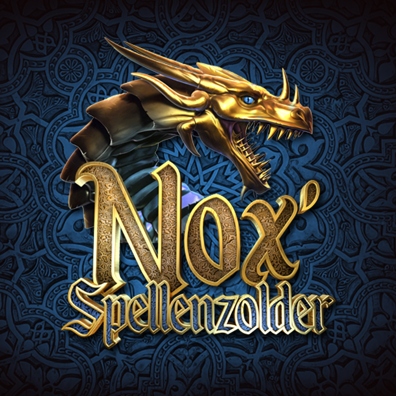

<p align="center">
 <br />
<span>Nox'Spellenzolder Boardgames Scoring dataset.</span>
</p>

<p align="center">
  <a href="#installation">Installation</a>
  &nbsp;&nbsp;&nbsp;|&nbsp;&nbsp;&nbsp;
  <a href="#usage">Usage</a>
</p>

## About

<a href="https://www.youtube.com/channel/UCtzMObnv92ni0T_8CHGtDag" target="_BLANK">Nox' Spellenzolder</a> is a Dutch Youtuber giving reviews of boardgames and scoring them. With the help of <a href="https://github.com/JPAntonisse/nox-spellenzolder-rating">JPAntonisse/nox-spellenzolder-rating</a> a list of boardgames with Nox' score is now available under ```results/dataset.csv```.

You can visit the official top50 of Nox' Spellenzolders <a href="https://www.nox-spellenzolder.nl/top-50/">here</a>, this is unfortunately shown without the grading, thats where this dataset can come in!


## Top-10
| title                                                | link                                        |  stars  |score ↓¹ | date ↓²             |
|:-----------------------------------------------------|:--------------------------------------------|--------:|--------:|:--------------------|
| Star Wars Armada: Super Star Destroyer (NL)          | <a href="https://www.youtube.com/watch?v=fDiCnbDd6Tg">YouTube</a> |     nan |      10 | 2019-02-09 00:00:00 |
| Fury of Dracula - 3rd Edition (NL)                   | <a href="https://www.youtube.com/watch?v=Bk6-AvuEdIg">YouTube</a> |       5 |      10 | 2016-12-19 00:00:00 |
| Magic the Gathering (NL)                             | <a href="https://www.youtube.com/watch?v=AYu5ool4YTo">YouTube</a> |       5 |      10 | 2016-10-16 00:00:00 |
| Codenames (NL) - Vanuit spellenwinkel "Spellenpoort" | <a href="https://www.youtube.com/watch?v=isuTVvwDt_I">YouTube</a> |       5 |      10 | 2015-10-12 00:00:00 |
| Legendary Encounters (NL)                            | <a href="https://www.youtube.com/watch?v=NmsICtnjEcg">YouTube</a> |       5 |      10 | 2015-09-02 00:00:00 |
| Sherlock Holmes - Consulting Detective (NL)          | <a href="https://www.youtube.com/watch?v=WIZGG7wepQQ">YouTube</a> |       5 |      10 | 2015-06-25 00:00:00 |
| 5-Minute Mystery (NL)                                | <a href="https://www.youtube.com/watch?v=XyDy0reI9LI">YouTube</a> |     nan |       9 | 2020-09-23 00:00:00 |
| It's a Wonderful World (NL)                          | <a href="https://www.youtube.com/watch?v=eHmLxN1dxpk">YouTube</a> |     nan |       9 | 2020-08-28 00:00:00 |
| Detective: L.A. Crimes & Dig Deeper (NL)             | <a href="https://www.youtube.com/watch?v=Dw6IVfFFhJs">YouTube</a> |     nan |       9 | 2020-08-27 00:00:00 |
| De Crew (NL)                                         | <a href="https://www.youtube.com/watch?v=woJbhpMOOEo">YouTube</a> |     nan |       9 | 2020-06-30 00:00:00 |


## Annual Top-5
### 2021
| title                                          | link                                                              |   stars |   score | date                |
|:-----------------------------------------------|:------------------------------------------------------------------|--------:|--------:|:--------------------|
| Wingspan: Uitbreiding Oceanië (NL)             | <a href="https://www.youtube.com/watch?v=KxRBgGKbyS0">YouTube</a> |     nan |       8 | 2021-04-01 00:00:00 |
| Through the Ages: New Leaders and Wonders (NL) | <a href="https://www.youtube.com/watch?v=8YhakXU9l8o">YouTube</a> |     nan |       8 | 2021-04-01 00:00:00 |
| Via Magica (NL)                                | <a href="https://www.youtube.com/watch?v=XesQX0asSDU">YouTube</a> |     nan |       7 | 2021-06-01 00:00:00 |
| Paranormale Detectives (NL)                    | <a href="https://www.youtube.com/watch?v=CGYtEsAuaVA">YouTube</a> |     nan |       7 | 2021-06-01 00:00:00 |
| Ethnos (NL)                                    | <a href="https://www.youtube.com/watch?v=kyVY_ugJkz8">YouTube</a> |     nan |       7 | 2021-04-01 00:00:00 |


### 2020
| title                                    | link                                                              |   stars |   score | date                |
|:-----------------------------------------|:------------------------------------------------------------------|--------:|--------:|:--------------------|
| 5-Minute Mystery (NL)                    | <a href="https://www.youtube.com/watch?v=XyDy0reI9LI">YouTube</a> |     nan |       9 | 2020-09-23 00:00:00 |
| Detective: L.A. Crimes & Dig Deeper (NL) | <a href="https://www.youtube.com/watch?v=Dw6IVfFFhJs">YouTube</a> |     nan |       9 | 2020-08-27 00:00:00 |
| De Crew (NL)                             | <a href="https://www.youtube.com/watch?v=woJbhpMOOEo">YouTube</a> |     nan |       9 | 2020-06-30 00:00:00 |
| Guards of Atlantis II (NL)               | <a href="https://www.youtube.com/watch?v=SHrXUwttwjc">YouTube</a> |     nan |       9 | 2020-04-25 00:00:00 |
| Hellapagos (NL)                          | <a href="https://www.youtube.com/watch?v=s1XIZ0nIy4I">YouTube</a> |     nan |       9 | 2020-02-11 00:00:00 |


### 2019
| title                                                | link                                                              |   stars |   score | date                |
|:-----------------------------------------------------|:------------------------------------------------------------------|--------:|--------:|:--------------------|
| Star Wars Armada: Super Star Destroyer (NL)          | <a href="https://www.youtube.com/watch?v=fDiCnbDd6Tg">YouTube</a> |     nan |      10 | 2019-02-09 00:00:00 |
| L.A.M.A. (NL)                                        | <a href="https://www.youtube.com/watch?v=r9uAuj-4XL4">YouTube</a> |     nan |       9 | 2019-10-07 00:00:00 |
| The Lord of the Rings: Journeys in Middle Earth (NL) | <a href="https://www.youtube.com/watch?v=WsS0D6E_Bcc">YouTube</a> |     nan |       9 | 2019-08-14 00:00:00 |
| Wingspan (NL)                                        | <a href="https://www.youtube.com/watch?v=0Hyi3yOnPUw">YouTube</a> |     nan |       9 | 2019-08-04 00:00:00 |
| Wander: The Cult of Barnacle Bay (NL)                | <a href="https://www.youtube.com/watch?v=fERjWNEZrrg">YouTube</a> |     nan |       9 | 2019-07-29 00:00:00 |


### 2018
| title                         | link                                                              |   stars |   score | date                |
|:------------------------------|:------------------------------------------------------------------|--------:|--------:|:--------------------|
| Chronicles of Crime (NL)      | <a href="https://www.youtube.com/watch?v=vnysV2nehN4">YouTube</a> |     nan |       9 | 2018-12-14 00:00:00 |
| Civilization: A New Dawn (NL) | <a href="https://www.youtube.com/watch?v=OvwGPgnXbwM">YouTube</a> |     nan |       9 | 2018-09-03 00:00:00 |
| Ganz Schon Clever (NL)        | <a href="https://www.youtube.com/watch?v=t-YDzxQfvVc">YouTube</a> |     nan |       9 | 2018-05-09 00:00:00 |
| Lords of Hellas (NL)          | <a href="https://www.youtube.com/watch?v=fZxtV39jmHs">YouTube</a> |     nan |       9 | 2018-05-05 00:00:00 |
| Ten Aanval! (NL)              | <a href="https://www.youtube.com/watch?v=_aw8EQzvt2A">YouTube</a> |     nan |       9 | 2018-04-24 00:00:00 |


### 2017
| title                                             | link                                                              |   stars |   score | date                |
|:--------------------------------------------------|:------------------------------------------------------------------|--------:|--------:|:--------------------|
| First Martians: Adventures on the Red Planet (NL) | <a href="https://www.youtube.com/watch?v=P6qqW7NHkLA">YouTube</a> |       4 |       8 | 2017-12-14 00:00:00 |
| Hypnose (NL)                                      | <a href="https://www.youtube.com/watch?v=5eGSYLXkbe8">YouTube</a> |     nan |       8 | 2017-06-30 00:00:00 |
| Claim (NL)                                        | <a href="https://www.youtube.com/watch?v=Srvul5NsVhA">YouTube</a> |       4 |       8 | 2017-02-09 00:00:00 |
| Agra (NL)                                         | <a href="https://www.youtube.com/watch?v=cJgoCarxu2o">YouTube</a> |       4 |       8 | 2017-02-12 00:00:00 |
| Castles of Mad King Ludwig (NL)                   | <a href="https://www.youtube.com/watch?v=KJRHUVMsAl0">YouTube</a> |       4 |       8 | 2017-02-14 00:00:00 |


### 2016
| title                              | link                                                              |   stars |   score | date                |
|:-----------------------------------|:------------------------------------------------------------------|--------:|--------:|:--------------------|
| Fury of Dracula - 3rd Edition (NL) | <a href="https://www.youtube.com/watch?v=Bk6-AvuEdIg">YouTube</a> |       5 |      10 | 2016-12-19 00:00:00 |
| Magic the Gathering (NL)           | <a href="https://www.youtube.com/watch?v=AYu5ool4YTo">YouTube</a> |       5 |      10 | 2016-10-16 00:00:00 |
| Mombasa (NL)                       | <a href="https://www.youtube.com/watch?v=dpTityr93Ts">YouTube</a> |       4 |       8 | 2016-03-05 00:00:00 |
| Star Wars Armada (NL)              | <a href="https://www.youtube.com/watch?v=0XIoxNVW0GM">YouTube</a> |       4 |       8 | 2016-03-06 00:00:00 |
| X-Wing Miniatures Game (NL)        | <a href="https://www.youtube.com/watch?v=Cc7alMNhAGI">YouTube</a> |     nan |       8 | 2016-03-22 00:00:00 |


### 2015
| title                                                | link                                                              |   stars |   score | date                |
|:-----------------------------------------------------|:------------------------------------------------------------------|--------:|--------:|:--------------------|
| Codenames (NL) - Vanuit spellenwinkel "Spellenpoort" | <a href="https://www.youtube.com/watch?v=isuTVvwDt_I">YouTube</a> |       5 |      10 | 2015-10-12 00:00:00 |
| Sherlock Holmes - Consulting Detective (NL)          | <a href="https://www.youtube.com/watch?v=WIZGG7wepQQ">YouTube</a> |       5 |      10 | 2015-06-25 00:00:00 |
| Legendary Encounters (NL)                            | <a href="https://www.youtube.com/watch?v=NmsICtnjEcg">YouTube</a> |       5 |      10 | 2015-09-02 00:00:00 |
| De Kolonisten van Catan "Kooplieden & Barbaren" (NL) | <a href="https://www.youtube.com/watch?v=4J9aDs0lTgY">YouTube</a> |       4 |       8 | 2015-05-13 00:00:00 |
| Brieven uit Whitechapel (NL)                         | <a href="https://www.youtube.com/watch?v=EtGS2nkRbGo">YouTube</a> |       4 |       8 | 2015-07-15 00:00:00 |


### 2014
| title                                  | link                                                              |   stars |   score | date                |
|:---------------------------------------|:------------------------------------------------------------------|--------:|--------:|:--------------------|
| Machi Koro (NL)                        | <a href="https://www.youtube.com/watch?v=y4EuI0tO-io">YouTube</a> |       4 |       8 | 2014-11-16 00:00:00 |
| Dungeon Command (NL)                   | <a href="https://www.youtube.com/watch?v=Tl18h9nkLXw">YouTube</a> |     nan |       8 | 2014-04-15 00:00:00 |
| Atlantic Triangle (NL)                 | <a href="https://www.youtube.com/watch?v=Jg334LmGmTQ">YouTube</a> |     nan |       8 | 2014-07-29 00:00:00 |
| Splendor (NL) - Samen met de Rode Pion | <a href="https://www.youtube.com/watch?v=S60bcUn--gM">YouTube</a> |     nan |       8 | 2014-02-06 00:00:00 |
| Through the Ages (NL)                  | <a href="https://www.youtube.com/watch?v=J79dGMSjCeg">YouTube</a> |     nan |       8 | 2014-02-07 00:00:00 |


### 2013
| title                                                             | link                                                              |   stars |   score | date                |
|:------------------------------------------------------------------|:------------------------------------------------------------------|--------:|--------:|:--------------------|
| Robinson Crusoe: Adventure on the Cursed Island (NL) - Deel 2 / 2 | <a href="https://www.youtube.com/watch?v=qYr1Vv9t5lk">YouTube</a> |     nan |       8 | 2013-11-20 00:00:00 |
| Sid Meier's  Civilization (NL) - Deel 2 / 2                       | <a href="https://www.youtube.com/watch?v=jkktvumIzG8">YouTube</a> |     nan |       8 | 2013-04-10 00:00:00 |
| Gosu - Kamakor (NL)                                               | <a href="https://www.youtube.com/watch?v=rVKKkkWErgE">YouTube</a> |     nan |       8 | 2013-01-07 00:00:00 |
| Takenoko (NL)                                                     | <a href="https://www.youtube.com/watch?v=h0bDxCbR9Pw">YouTube</a> |     nan |       8 | 2013-01-15 00:00:00 |
| Quest for the Princess (NL)                                       | <a href="https://www.youtube.com/watch?v=uFx2ptkFNIo">YouTube</a> |     nan |       8 | 2013-04-02 00:00:00 |


### 2012
| title                       | link                                                              |   stars |   score | date                |
|:----------------------------|:------------------------------------------------------------------|--------:|--------:|:--------------------|
| Galaxy Trucker (NL)         | <a href="https://www.youtube.com/watch?v=ZBk-gbBT6Fc">YouTube</a> |     nan |       8 | 2012-12-19 00:00:00 |
| Glory to Rome NL            | <a href="https://www.youtube.com/watch?v=ytROagXwLLQ">YouTube</a> |     nan |       8 | 2012-07-17 00:00:00 |
| Coco Colecto (NL)           | <a href="https://www.youtube.com/watch?v=_hvBy-rWkI8">YouTube</a> |     nan |       8 | 2012-12-16 00:00:00 |
| Quarriors (NL)              | <a href="https://www.youtube.com/watch?v=JyxzE4TCo0U">YouTube</a> |     nan |       8 | 2012-03-13 00:00:00 |
| Indonesia (NL) - Deel 2 / 2 | <a href="https://www.youtube.com/watch?v=dS9Ai6jzH8M">YouTube</a> |     nan |       8 | 2012-07-12 00:00:00 |


### 2011
| title                             | link                                                              |   stars |   score | date                |
|:----------------------------------|:------------------------------------------------------------------|--------:|--------:|:--------------------|
| Carcassonne - De Uitbreiding (NL) | <a href="https://www.youtube.com/watch?v=rGl87-v9C20">YouTube</a> |     nan |       9 | 2011-07-26 00:00:00 |
| Chez Geek (NL)                    | <a href="https://www.youtube.com/watch?v=265zyg8DfxA">YouTube</a> |     nan |       8 | 2011-11-06 00:00:00 |
| Naval Battles (NL)                | <a href="https://www.youtube.com/watch?v=z2rA6rruvU8">YouTube</a> |     nan |       8 | 2011-09-26 00:00:00 |
| Zeevaarders van Catan (NL)        | <a href="https://www.youtube.com/watch?v=4fn3ELILriU">YouTube</a> |     nan |       8 | 2011-07-29 00:00:00 |
| De Grote Dalmuti (NL)             | <a href="https://www.youtube.com/watch?v=-m98XKwL6pA">YouTube</a> |     nan |       6 | 2011-10-17 00:00:00 |


## Dataset
The complete ranking of Nox' boardgames is available in the dataset ```results/dataset.csv```.  The available columns in the datasets are listed below. The only thing to note is that the columns 'stars' is a rating out of 5, that is normalized to score (out of 10). This is due to legacy videos graded with stars instead of score.

```code
title;link;id;stars;score;date
```

### Statistics

| variable: score  | dtype: float64 |
| ------------- | ------------- |
|count | 1110.000000|
|mean | 6.289189|
|std |  1.807252|
|min |  2.0|
|25% |  6.00|
|50% |  7.0|
|75% |  8.0|
|max | 10.0|

### limits
The extraction process of the scores is limited to the caption translation of Youtube, therefore, it is prone to mistakes during scoring. The correctness of this dataset is estimated, by sampling, to be ~80%. Because of importance to the top-10, the scores with ```10.0``` are manually checked and corrected where necessary.  

## Installation

```console
# clone the repo
$ git clone https://github.com/JPAntonisse/nox-spellenzolder-rating.git

# install the requirements
$ python3 -m pip install -r requirements.txt
```


## Usage

```console
$ python3 noxdataset
```

